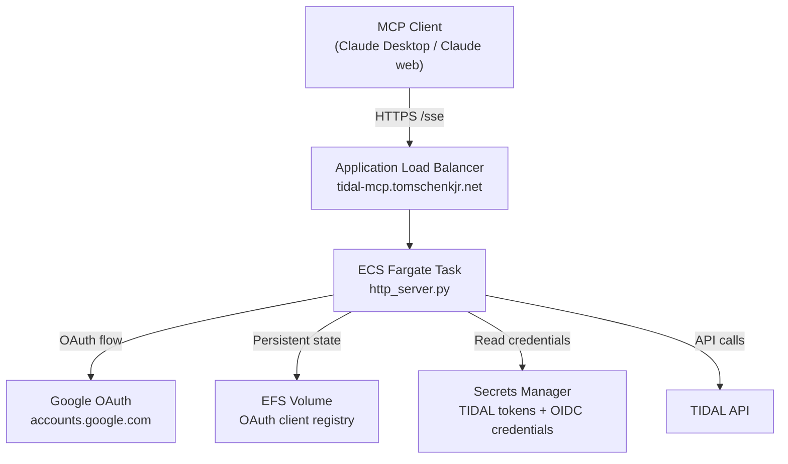

# Deployment

The production server runs on AWS ECS Fargate behind an Application Load Balancer. Infrastructure is managed in a separate repository: [tomschenkjr/mcp-aws-infra](https://github.com/tomschenkjr/mcp-aws-infra).

## Architecture



## Environment variables

The HTTP server reads these variables at startup. Variables marked **Secret** are injected from AWS Secrets Manager via the ECS task definition `secrets` block — they are never stored as plain text in Terraform or the task definition.

| Variable              | Required              | Secret | Description                                                    |
|-----------------------|-----------------------|--------|----------------------------------------------------------------|
| `PORT`                | No (default: `3000`)  | No     | Port the server listens on                                     |
| `AWS_REGION`          | Yes                   | No     | AWS region (e.g. `us-east-1`)                                  |
| `TIDAL_SECRET_NAME`   | Yes                   | No     | Secrets Manager secret name for TIDAL OAuth tokens             |
| `OIDC_CLIENT_ID`      | Yes (enables auth)    | No     | Google OAuth client ID                                         |
| `MCP_BASE_URL`        | Yes (if auth enabled) | No     | Public URL of this server (e.g. `https://tidal-mcp.example.com`) |
| `OIDC_CLIENT_SECRET`  | Yes (if auth enabled) | **Yes** | Google OAuth client secret — from `mcp/tidal-mcp-oidc:client_secret` |
| `MCP_JWT_SIGNING_KEY` | Yes (if auth enabled) | **Yes** | Key for signing FastMCP JWTs — from `mcp/tidal-mcp-oidc:jwt_signing_key` |
| `FASTMCP_HOME`        | Yes (if auth enabled) | No     | Path for persistent OAuth state — set to the EFS mount path    |

When `OIDC_CLIENT_ID` is not set, the server starts without authentication (local development mode).

## Google OAuth setup

Perform these steps once in [Google Cloud Console](https://console.cloud.google.com):

1. Go to **APIs & Services → Credentials**
2. Create an **OAuth 2.0 Client ID** — type: **Web application**
3. Add an authorized redirect URI: `https://tidal-mcp.tomschenkjr.net/auth/callback`
4. Copy the **Client ID** and **Client Secret**

Store the Client Secret in AWS Secrets Manager under `mcp/tidal-mcp-oidc`:

```json
{
  "client_secret": "<Google OAuth client_secret>",
  "jwt_signing_key": "<output of: openssl rand -hex 32>"
}
```

Generate the JWT signing key with:

```bash
openssl rand -hex 32
```

The `jwt_signing_key` signs the tokens that FastMCP issues to MCP clients (Claude). Use a stable value — changing it invalidates all active sessions.

## TIDAL authentication

TIDAL credentials must be stored in Secrets Manager before the server can make API calls.

Run the local authentication helper:

```bash
uv run python authenticate.py
```

This opens a browser for TIDAL's OAuth flow and saves session data to `.tidal-sessions/session.json`. Upload the contents of that file to the `mcp/tidal-mcp` secret in Secrets Manager:

```bash
aws secretsmanager put-secret-value \
  --secret-id mcp/tidal-mcp \
  --secret-string "$(cat .tidal-sessions/session.json)"
```

The server loads TIDAL credentials from Secrets Manager on startup (set via `TIDAL_SECRET_NAME`). If the TIDAL session expires, re-run `authenticate.py` and re-upload.

## OAuth client persistence

MCP clients (Claude Desktop, Claude web) register themselves via Dynamic Client Registration (DCR) on first connection. The server stores these registrations in a DiskStore at `$FASTMCP_HOME/oauth-proxy/`.

An EFS volume is mounted at the `FASTMCP_HOME` path so registrations survive ECS container replacements. Without EFS, any deployment or container restart would wipe all client registrations, forcing every MCP client to re-authenticate.

If the EFS volume is reset or the OAuth state is lost, MCP clients need to clear their cached credentials and reconnect. In Claude Desktop, remove and re-add the server connection. Claude will register itself again automatically.

## Health check

```bash
curl https://tidal-mcp.tomschenkjr.net/health
# {"status": "healthy", "service": "tidal-mcp"}
```

The ALB health check polls `GET /health` every 30 seconds. A task that fails health checks is replaced automatically.

## Logs

Container logs go to CloudWatch under `/ecs/tidal-mcp`. To view recent logs:

```bash
aws logs tail /ecs/tidal-mcp --follow
```

Access requires `logs:GetLogEvents` permission on that log group.

## Force a redeployment

To deploy a new container image without a Terraform change:

```bash
aws ecs update-service \
  --cluster mcp-cluster \
  --service tidal-mcp \
  --force-new-deployment
```

The ALB drains the old task (typically under 60 seconds) before the new one takes traffic.
